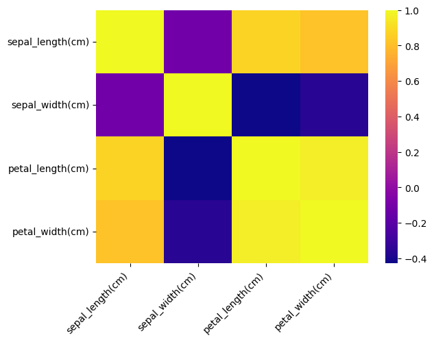
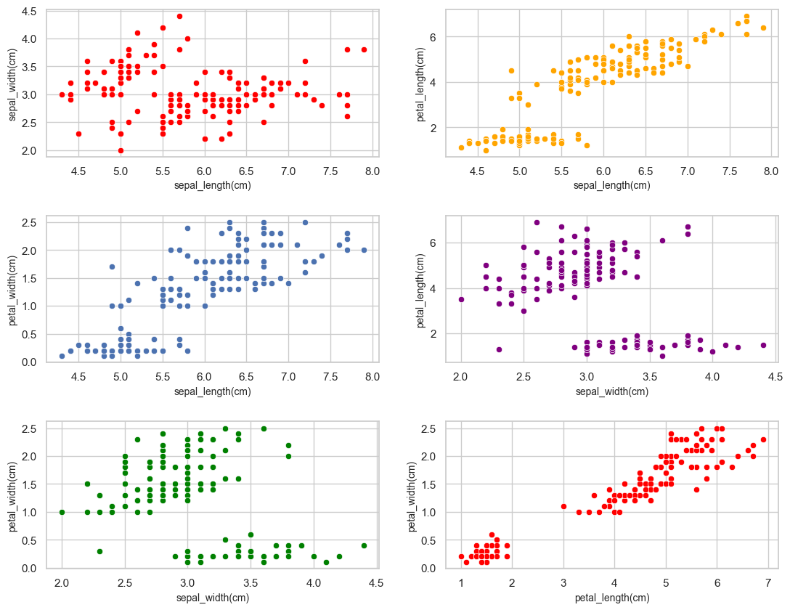
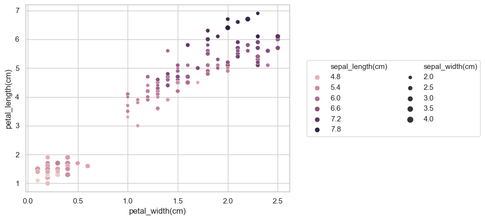
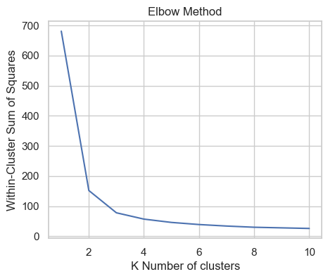
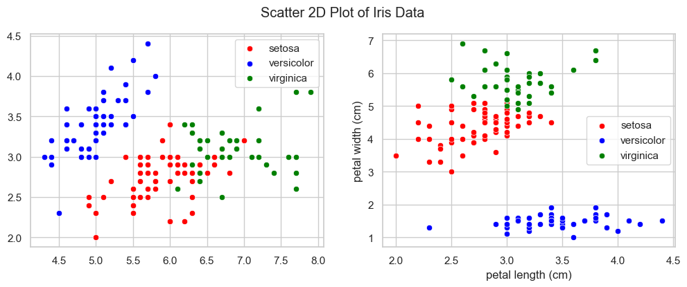
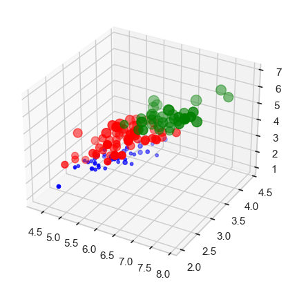
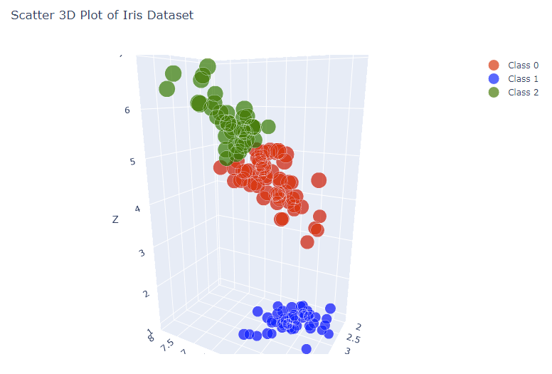

# K- Means Clustering

Author: Muhammad Umar Anzar

K-Means Clustering is a popular unsupervised machine learning algorithm used for clustering data points into K groups or clusters. The algorithm starts by randomly selecting K centroids, which are the center points of each cluster. It then assigns each data point to the nearest centroid and repositions the centroids based on the mean of the assigned points. This process is repeated until the centroids no longer move significantly. The resulting clusters can be used to identify patterns and insights in the data, and to segment the data into meaningful groups. K-Means Clustering is widely used in fields such as marketing, customer segmentation, and image segmentation.

## Import Libraries

- Math: The math module provides a variety of functions for mathematical operations. It also provides constants for mathematical values, such as pi and e.

- Itertools: The itertools module provides a variety of functions for creating and manipulating iterators. Iterators are objects that can be used to iterate over a sequence of values.

- NumPy: A Python library used for numerical computing. It provides support for multidimensional arrays and matrices, along with functions to perform mathematical operations on them.

- Pandas: A library used for data manipulation and analysis. It provides data structures for efficient storage and manipulation of tabular data.

- Matplotlib: A plotting library for creating static, interactive, and animated visualizations in Python.

- Mpl_toolkits: A collection of tools and extensions for Matplotlib, a popular data visualization library in Python.

- Plotly: A Data visualization library for creating interactive, publication-quality graphs, charts, and dashboards in Python.

- Seaborn: A data visualization library based on Matplotlib.

- Scikit-learn: A machine learning library for Python. It provides a range of algorithms for classification, regression, clustering, and dimensionality reduction, along with tools for model selection and evaluation.


```python
import math, numpy as np, pandas as pd, matplotlib.pyplot as plt, seaborn as sns
from mpl_toolkits import mplot3d
import plotly.graph_objects as go
import plotly.offline as offline
offline.init_notebook_mode()
from sklearn.model_selection import train_test_split
from sklearn.cluster import KMeans
from sklearn import datasets
from itertools import combinations
# allows for displaying plots inline within the notebook
%matplotlib inline 
```


## Import Dataset
- The iris dataset is a classic and very easy multi-class classification dataset.

<center>

|          |            |
|:--------:|:----------:|
| Classes  |      3     |
| Samples per class | 50 |
| Samples total | 150 |
| Dimensionality | 4 |
| Features | real, positive |

</center>

```python
iris = datasets.load_iris()
print("Attributes in iris data: ",iris.keys())
iris.data[:4,:] # print some rows
```

    Attributes in iris data:  dict_keys(['data', 'target', 'frame', 'target_names', 'DESCR', 'feature_names', 'filename', 'data_module'])
    

    array([[5.1, 3.5, 1.4, 0.2],
           [4.9, 3. , 1.4, 0.2],
           [4.7, 3.2, 1.3, 0.2],
           [4.6, 3.1, 1.5, 0.2]])


```python
print("Feature names: ", iris.feature_names)
```

    Feature names:  ['sepal length (cm)', 'sepal width (cm)', 'petal length (cm)', 'petal width (cm)']
    


```python
columnNameFunc = lambda x: (x.replace(" ","_",1)).replace(" ","")
columnName = list(map(columnNameFunc, iris.feature_names))
```


```python
dataset = pd.DataFrame(data=iris.data, columns=columnName)
dataset.head(5)
```


<div>
<table border="1" class="dataframe">
  <thead>
    <tr style="text-align: right;">
      <th></th>
      <th>sepal_length(cm)</th>
      <th>sepal_width(cm)</th>
      <th>petal_length(cm)</th>
      <th>petal_width(cm)</th>
    </tr>
  </thead>
  <tbody>
    <tr>
      <th>0</th>
      <td>5.1</td>
      <td>3.5</td>
      <td>1.4</td>
      <td>0.2</td>
    </tr>
    <tr>
      <th>1</th>
      <td>4.9</td>
      <td>3.0</td>
      <td>1.4</td>
      <td>0.2</td>
    </tr>
    <tr>
      <th>2</th>
      <td>4.7</td>
      <td>3.2</td>
      <td>1.3</td>
      <td>0.2</td>
    </tr>
    <tr>
      <th>3</th>
      <td>4.6</td>
      <td>3.1</td>
      <td>1.5</td>
      <td>0.2</td>
    </tr>
    <tr>
      <th>4</th>
      <td>5.0</td>
      <td>3.6</td>
      <td>1.4</td>
      <td>0.2</td>
    </tr>
  </tbody>
</table>
</div>


```python
print("Data dimension", dataset.shape)
```

    Data dimension (150, 4)
    

## Plot 2d Graph

### Heatmap of Correlation
Firstly, the correlation between the features was checked. Based on the correlation matrix, it appears that sepal_width has a weak correlation with sepal_length and a moderate negative correlation with petal_length and petal_width. Petal_length has a strong relationship with petal_width and a moderate relationship with sepal_length.


```python
sns.heatmap(dataset.corr(), cmap='plasma')
plt.xticks(rotation=45, ha="right")
plt.show()
dataset.corr()
```


    

    


<div>
<table border="1" class="dataframe">
  <thead>
    <tr style="text-align: right;">
      <th></th>
      <th>sepal_length(cm)</th>
      <th>sepal_width(cm)</th>
      <th>petal_length(cm)</th>
      <th>petal_width(cm)</th>
    </tr>
  </thead>
  <tbody>
    <tr>
      <th>sepal_length(cm)</th>
      <td>1.000000</td>
      <td>-0.117570</td>
      <td>0.871754</td>
      <td>0.817941</td>
    </tr>
    <tr>
      <th>sepal_width(cm)</th>
      <td>-0.117570</td>
      <td>1.000000</td>
      <td>-0.428440</td>
      <td>-0.366126</td>
    </tr>
    <tr>
      <th>petal_length(cm)</th>
      <td>0.871754</td>
      <td>-0.428440</td>
      <td>1.000000</td>
      <td>0.962865</td>
    </tr>
    <tr>
      <th>petal_width(cm)</th>
      <td>0.817941</td>
      <td>-0.366126</td>
      <td>0.962865</td>
      <td>1.000000</td>
    </tr>
  </tbody>
</table>
</div>


### Scatter plot of each combination of four columns.

Based on the observation of the scatter plot graphs, it can be inferred that there are at least two clusters present in each plot.


```python
sns.set(rc={'figure.figsize':(5,4)})
sns.set_style("whitegrid")

comb = list(combinations(dataset.columns,2))

fig, axis1 = plt.subplots(nrows=len(comb)//2, ncols=2, figsize=(13, 10))
color_arr = ['red','orange',None,'purple','green']

fig.subplots_adjust(wspace=0.2, hspace=0.4)
for i, (j, k) in enumerate(comb):
    axis = axis1[i//2, i%2]
    sns.scatterplot(x=j,y=k,data=dataset, ax=axis, color=color_arr[i%len(color_arr)])
    axis.set_xlabel(j, fontsize=10)
    axis.set_ylabel(k, fontsize=10)
plt.show()
```


    

    


### Scatter plot of each column in single 2d graph

In this scatter plot, petal width and length are plotted on the x- and y-axes, respectively. The remaining features are used to set the hue and radius size of the points. 

Three distinct clusters can be identified in the plot, based on their position, color and size.


```python
plt.figure(figsize=(7, 5))
scatterplot = sns.scatterplot(x='petal_width(cm)', 
                              y='petal_length(cm)', 
                              data=dataset, 
                              size='sepal_width(cm)', 
                              hue='sepal_length(cm)')
scatterplot.legend(loc='center left', bbox_to_anchor=(1.05, 0.5), ncol=2)
plt.show()
```


    

    


## Preparing X


```python
x = dataset.values
```

## Clustering Analysis

Clustering Analysis is a technique in unsupervised learning that groups data points or observations into clusters based on their similarity or proximity to each other.

The Within-Cluster Sum of Squares (WCSS) is a measure used in clustering algorithms to evaluate the quality of the clustering results. It represents the sum of squared distances between each data point and its assigned cluster centroid, also known as the cluster's mean or center.
- Lower wcss, good quality of cluster

"The elbow method" is a technique used to determine the optimal number of clusters in a dataset for a clustering algorithm. The idea behind this method is to identify the value of k, the number of clusters, where the decrease in the sum of squared distances between the data points and their assigned clusters (also known as the Within-Cluster Sum of Squares or WCSS) begins to level off.
- The optimal number of clusters can be identified using the elbow method, which involves selecting the number of clusters at the elbow point where the within-cluster sum of squares (WCSS) no longer decreases significantly with each iteration. 


```python
n = 11
wcss = np.empty(n-1, dtype='int32')
for i in range(1,n):
    kmeans = KMeans(n_clusters=i, init='k-means++', max_iter=300, n_init=10, random_state=0)
    kmeans.fit(x)
    wcss[i-1] = kmeans.inertia_
```


```python
plt.plot(range(1,n), wcss)
plt.title("Elbow Method")
plt.xlabel('K Number of clusters')
plt.ylabel('Within-Cluster Sum of Squares')
plt.show()
```


    

    


The number of clusters where the elbow point occurs is "3".

### Creating the kmeans classifier


```python
kmeans = KMeans(n_clusters=3, init='k-means++', max_iter=300, n_init=10, random_state=0)
y = kmeans.fit_predict(x)
```

### Naming Clusters


```python
iris.target_names
```


    array(['setosa', 'versicolor', 'virginica'], dtype='<U10')


## Plotting Clusters


```python
fig, axis1 = plt.subplots(ncols=2, figsize=(12, 4))
fig.suptitle("Scatter 2D Plot of Iris Data")
for i in range(2):

    sns.scatterplot(x=x[y==0, i], y=x[y==0, i+1],  ax=axis1[i], color='red', label='setosa')
    sns.scatterplot(x=x[y==1, i], y=x[y==1, i+1],  ax=axis1[i], color='blue', label='versicolor')
    sns.scatterplot(x=x[y==2, i], y=x[y==2, i+1],  ax=axis1[i], color='green', label='virginica')
    plt.xlabel(iris.feature_names[2*i])
    plt.ylabel(iris.feature_names[2*i+1])
   
plt.legend()
plt.show()
```


    

    


### 3d Plot


```python
fig = plt.figure(figsize=(5, 5))
ax = plt.axes(projection='3d')
i = 0
ax.scatter3D(x[y==0, i], x[y==0, i+1], x[y==0, i+2], s=50*x[y==0, i+3], c='red')
ax.scatter3D(x[y==1, i], x[y==1, i+1], x[y==1, i+2], s=50*x[y==1, i+3], c='blue')
ax.scatter3D(x[y==2, i], x[y==2, i+1], x[y==2, i+2], s=50*x[y==2, i+3], c='green')

plt.show()

```


    

    


### Interactive 3d Plot
4th dimension of dataset is used as marker size/ marker radius but passing through sigmoid function which can help to "flatten out" the data so that **smaller values are still visible**, while **larger values are not so overwhelming**.


```python
def sigmoid(x):
    return 1 / (1 + np.exp(-x))
print(np.mean(sigmoid(x[y==0, 3])))
print(np.mean(sigmoid(x[y==1, 3])))
print(np.mean(sigmoid(x[y==2, 3])))
```

    0.803449275154388
    0.5610021747070598
    0.8850642221811069
    


```python
fig = go.Figure()

for i in range(3):
    fig.add_trace(go.Scatter3d(
        x=x[y==i, 0],
        y=x[y==i, 1],
        z=x[y==i, 2],
        mode='markers',
        marker=dict(
            size=30*sigmoid(x[y==i, 3]),
            color=['red', 'blue', 'green'][i],
            opacity=0.7
        ),
        name=f'Class {i}'
    ))
    
fig.update_layout(
    width=800,
    height=600,
    title='Scatter 3D Plot of Iris Dataset',
    scene=dict(
        xaxis_title='X',
        yaxis_title='Y',
        zaxis_title='Z',
    )
)


fig.show()
```

